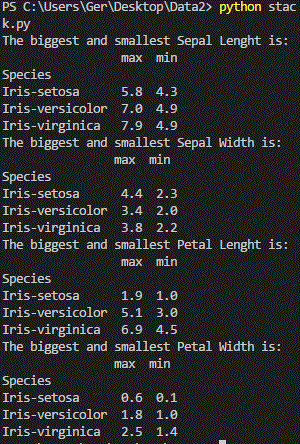
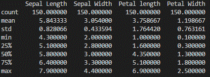
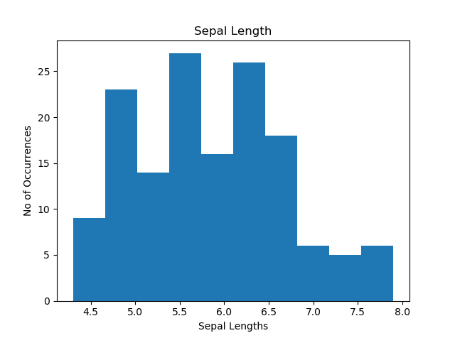
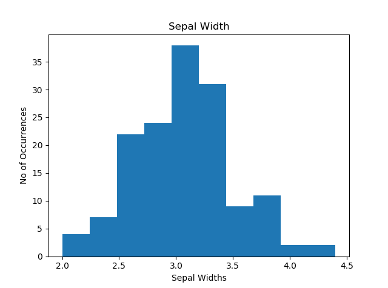
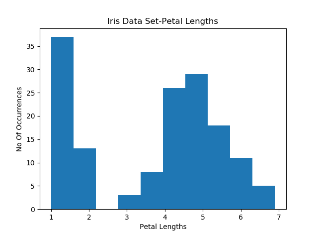
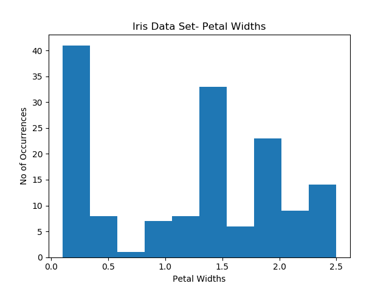

   # **PROJECT 2018**
   ## **The Iris Flower Data-Set**
   
   ### ___Ronald Fisher___ 
   
     
   
Ronald Fisher was a British statistician and geneticist and is regarded as the single most important figure in 20th century statistics[1]. Fisher and in particular the Iris Flower Data Set played a significant role in pattern recognition and discriminant analysis which in turn is important in the area of Data Analytics . Data Analysis can be described as the process of inspecting, cleansing, transforming and modelling data with the aim of determining valuable information, suggesting conclusions and supporting decision making[2]

## The Dataset

The Iris Flower Dataset is an excellent example of a resource that has become a mainstay of the computing world, particularly for testing purposes. New types of sorting and taxonomy models often use the dataset as an input to examine how different technologies will sort and handle datasets. The Iris dataset might be used by a programmer for the purposes of testing a decision tree, or a piece of machine learning software. This is the reason the Iris Flower Dataset is so interesting to programmers, and such is its popularity, the dataset is built into some coding libraries (techopedia.com). The Iris dataset has been analysed via two separate methods. First, plotted the dataset onto scatterplots to determine patterns in the data in relation to the Iris classifications. Second, developed an application in Java that will run a series of methods on the dataset to extract relevant statistical evidence (Hoey,P).

The dataset includes the following five attributes:
   1. sepal length in centimeters 
   2. sepal width in centimeters 
   3. petal length in centimeters 
   4. petal width in centimeters 
   5. class: 
   
      + Iris Setosa
      
      + Iris Versicolour  
      
      + Iris Virginica
      

## The Importance of Data Analytics 

Data is considered the raw material of the 21st century (1). With the availability of data with huge volume, velocity and variety has come the potential to lead to enhance a firms decision making performance with the associated competitive advantage (Chen et al, 2012). Decision makers need to be able to gain valuable insights from such quickly fluctuating data by using big data analytics; this will enable them to make better, more informed, and faster decisions. In a report by PWC, they propose that all majors should require some foundational knowledge of analytics and the data science process. Data visualisation is an excellent example of such knowledge as it mixes art and science, helping students use data to express themselves in creative ways.[4] According to Oracle, in 2013 organisations were generating 300TB of data weekly (Ward, J & Barker,A 2013). This poses a significant challenge, and opportunity as companies need to get as much value as possible from this data. Later on we will look at how Python can analyse the Iris Dataset which is a small but not insignificant set. In her article, Clodagh states that many e-commerce businesses are using big data to their advantage by carefully evaluating the browsing behaviour of their users, these companies better understand their shoppers, their habits, and their needs, this information, once understood is then used to their competitive advantage. There are a number of issues to consider before data can be used, the first, is how will the business gather data- collecting transaction information, social media and web history are a few methods. The next step is to evaluate the data’s relevance and accuracy, once you have the relevant data, many companies have failed to put in place data analysts to investigate the data, and this puts them at a distinct disadvantage to competitors who have invested in data analysts. Once the data has been collected and interrogated the next step is to visualise the data, this give you the ability to represent the information collected in a more understandable manner. As we will see, Python is an extremely useful tool for analysing data and producing various graphs, charts and other visualisation techniques to help with this endeavour.

## Why Python?

There are many reasons why I chose to use Python to analyse the data. Firstly, as a beginner to programming it is an easy to understand and relatively straight forward language to learn. As it is a very high-level language it reads like English, taking much of the syntax learning away. Another advantage of Python is that it has extensive support libraries that are useful for document generation, image manipulation, databases and many more. The Python interpreter is easily extended with new functions and data types implemented in C or C++. It is also cross platform so can run on many operating systems such as Microsoft Windows, Linus and Mac OS X. Python is free and open source, and there are many websites that provide useful insights to Python and are happy to help with any programming problems you might encounter! I will show later how a few simple lines of code enabled me to intergate the data with useful results and graphs that will perhaps challenge those results.

## Analysing the Data

1. [The maximun length of each column](https://github.com/Gerrydh/Project-2018/blob/master/Python%20Scripts/Max%20and%20Min%20by%20species.py)

Clicking on the link above will bring us into the code used to return the maximum and minimum value of each of the columns from the dataset. As you can see just a few lines of code were required to return these values, including the species of each flower. Here we can quickly see the values and the species neatly formatted as shown in the image below. We can also get the same result by clicking [here](https://github.com/Gerrydh/Project-2018/edit/master/Python%20Scripts/Min%20&%20Max%20Sepal%20Lengths.py). As you can see these are two very different ways to achieve the same result. In my limited programming experience, I have not yet managed to return the maximum and minimum values for each category in a single script, so we would need 4 separate pieces of code to find these values.

  
 
 2. [The Describe Function](https://github.com/Gerrydh/Project-2018/blob/master/Python%20Scripts/Describe.py)
 
The Describe function is another that can quickly and succinctly return some useful information relating to the dataset. Again clicking into the above link will display the script used to generate this result. This shows us the mean (average) of each category in the dataset. It also returns the maximum and minimum values of each category. The standard deviation tells us about the distribution of scores around the mean. This function also displays the 25th, 50th and 75th percentile for each category in the analysis.
 
 
 
 3. The Mean of each category
 
 
 
   
   3.1. [The Sepal Length](https://github.com/Gerrydh/Project-2018/blob/master/Python%20Scripts/Meanseplen.py)
   The average sepal lenght is 5.84. The range is from 4.30 to 7.90, so this would suggest that 5.84 is a reasonable result, we can investigate this furhter by reviewing the histogram that this code produced. As we can see most of the range is in and around this value so I think is a representitive value.
   

   
   3.2. [The Sepal Width](https://github.com/Gerrydh/Project-2018/blob/master/Python%20Scripts/Meansepwid.py)
      The average sepal width is 3.05. The range in this category is 2.00 to 4.40. Just looking at this, it would suggest that something is a little off as in my opinion the average is too close to the lowest value. Looking at the Histogram will help identify any anomalies in the dataset. As we can see, the vast majority of the sepal widths are bunched very close to the median and there are not many occurrences in the lowest and highest sepal widths.
   
   
   
   3.3. [The Petal Length](https://github.com/Gerrydh/Project-2018/blob/master/Python%20Scripts/Meanpetlen.py)
      The average petal length is 3.76. The range in this category 1.00 to 6.90, this has the biggest range in sizes, and it will be interesting to see what the histogram reveals. The average is 3.75. As we can see from the histogram, the data is grouped into two areas. Almost a third are no bigger than two centimetres, which is nearly 50% smaller than the average, while there are not many around the average size. Then the sizes are spread out between 4 and 5.5 centimetres. I would say that the mean is not really reflective of the actual dataset.
   
   
   
   3.4. [The Petal Widths](https://github.com/Gerrydh/Project-2018/blob/master/Python%20Scripts/Meanpetwid.py)
The average petal width is 1.20. The range of sizes for this attribute is 0.1 to 2.5, this has the biggest disparity between the smallest and biggest petals. Again we can see that the data is divided into 2, and again we can see that almost of the third of the range is well below the average. There are not many occurrences around the average size. As with the petal lengths I would say that it is not representative of the actual sizes. It is worth noting that the petal lengths appear to vary greatly in sizes compared to the sepal sizes.
   
   
  
