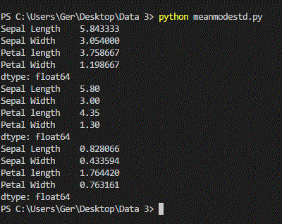
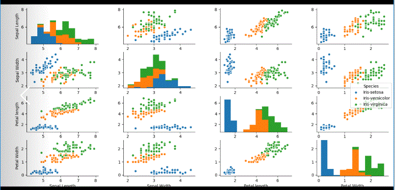

   # **PROGRAMMING AND SCRIPTING PROJECT 2018**
   
   
   
   ## The Iris Dataset

The dataset consists the following five attributes:
   1. sepal length in centimetres 
   2. sepal width in centimetres 
   3. petal length in centimetres 
   4. petal width in centimetres 
   5. class: 
   
      + Iris Setosa
      
      + Iris Versicolour  
      
      + Iris Virginica
      
Based on these attributes, Fisher developed a linear discriminant model to distinguish the species from each other [1]. The sepal of a flower can be described as the outer parts of the flower, it is leaf and encloses the developing bud. While the petals are upright and colourful [2]. 

The Iris Flower Dataset is interesting to programmers as it is an excellent example of a resource that has become a mainstay of the computing world, particularly for testing purposes, and such is its popularity, the dataset is built into many coding libraries [3]. New types of sorting and taxonomy models often use the dataset as an input to examine how different technologies will sort and handle datasets. The Iris dataset might be used by a programmer for the purposes of testing a decision tree, or a piece of machine learning software [3]. The Iris dataset has been analysed via two separate methods. First, plotted the dataset onto scatterplots to determine patterns in the data in relation to the Iris classifications. Second, developed an application in Java that will run a series of methods on the dataset to extract relevant statistical evidence [4].

   
## Ronald Fisher 
   
     
   
Ronald Fisher was a British statistician and geneticist and is regarded as the single most important figure in 20th century statistics [1]. Fisher and in particular the Iris Flower Data Set played a significant role in pattern recognition and discriminant analysis which in turn is important in the area of Data Analytics. The analysis was conducted in 1936 and contributed to his widely regarded book *The use of multiple measurements in taxonomic problems*. Data Analysis can be described as the process of inspecting, cleansing, transforming and modelling data with the aim of determining valuable information, suggesting conclusions and supporting decision making [2].

      

## The Importance of Data Analytics 
According to Intel, in 2013 organisations were generating 300TB of data weekly [5], with over 15 billion devices and ever-increasing storage capacity, it is for this reason that data is now considered the raw material of the 21st century [6]. This poses a significant challenge, and opportunity as companies need to get as much value as possible from this data. With the availability of data with huge volume, velocity and variety has come the potential to enhance an organisation’s decision-making performance with the associated competitive advantage [7]. Decision makers need to be able to gain valuable insights from such quickly fluctuating data by using big data analytics; this will enable them to make better, more informed, and faster decisions [6]. If done properly data analytics can identify where improvements are required, where trends in sales have fluctuated and if there are any potential gaps in the market. In a report by PWC, they propose that all degrees should require some foundational knowledge of analytics and the data science process. Data visualisation is an excellent example of such knowledge as it mixes art and science, helping students use data to express themselves in creative ways [8].   

In her article, Clodagh states that many e-commerce businesses are using big data to their advantage by carefully evaluating the browsing behaviour of their users, these companies better understand their shoppers, their habits, and their needs, this information, once understood is then used to their competitive advantage. There are a number of issues to consider before data can be used, the first, is how will the business gather data- collecting transaction information, social media and web history are a few methods. The next step is to evaluate the data’s relevance and accuracy, once you have the relevant data, many companies have failed to put in place data analysts to investigate the data, and this puts them at a distinct disadvantage to competitors who have invested in data analysts. Once the data has been collected and interrogated the next step is to visualise the data, this give you the ability to represent the information collected in a more understandable manner [9]. As we will see, Python is an extremely useful tool for analysing data and producing various graphs, charts and other visualisation techniques to help with this endeavour.

## Why Python?

There are many reasons why I chose to use Python to analyse the data. Firstly, as a beginner to programming it is an easy to understand and relatively straight forward language to learn. As it is a very high-level language it reads like English, taking much of the syntax learning away. Another advantage of Python is that it has extensive support libraries that are useful for document generation, image manipulation, databases and many more. The Python interpreter is easily extended with new functions and data types implemented in C or C++. It is also cross platform so can run on many operating systems such as Microsoft Windows, Linus and Mac OS X. Python is free and open source, and there are many websites that provide useful insights to Python and are happy to help with any programming problems you might encounter! I will show later how a few simple lines of code enabled me to interrogate the data with useful results and graphs that will perhaps challenge those results.

## Analysing the Data

A. [Quick Analysis of the Dataset](https://github.com/Gerrydh/Project-2018/blob/master/Python%20Scripts/QuickAnalysis.py)

  By way of a quick introduction and summary of the dataset we can run the scipt in the link above to quickly and neatly show us the mean, median and standard deviations of each attribute. The mean function shows the average of each column or atrribute. The median function returns the middle value of the dataset, as there is an uneven number of values, the median is mean of the two middle values. Finally, the standard deviation describes how concentrated the data are around the mean. 
  
  

B. [The maximun length of each column](https://github.com/Gerrydh/Project-2018/blob/master/Python%20Scripts/Max%20and%20Min%20by%20species.py)

Clicking on the link above will bring us into the code used to return the maximum and minimum value of each of the columns from the dataset. As you can see just a few lines of code were required to return these values, including the species of each flower. Here we can quickly see the values and the species neatly formatted as shown in the image below. We can also get the same result by clicking [here](https://github.com/Gerrydh/Project-2018/edit/master/Python%20Scripts/Min%20&%20Max%20Sepal%20Lengths.py). As you can see these are two very different ways to achieve the same result.

  
 
 C. [The Describe Function](https://github.com/Gerrydh/Project-2018/blob/master/Python%20Scripts/Describe.py)
 
The Describe function is another that can quickly and succinctly return some useful information relating to the dataset. Again clicking into the above link will display the script used to generate this result. This shows us the mean (average) of each category in the dataset. It also returns the maximum and minimum values of each category. The standard deviation tells us about the distribution of scores around the mean. This function also displays the 25th, 50th and 75th percentile for each category in the analysis.
 
 
 
 D. The Mean of each category
 
 [Sepal lenght script](https://github.com/Gerrydh/Project-2018/blob/master/Python%20Scripts/Meanseplen.py)
  
 
 
 [Sepal widths script](https://github.com/Gerrydh/Project-2018/blob/master/Python%20Scripts/Meansepwid.py)  
 

   
[Petal lengths script](https://github.com/Gerrydh/Project-2018/blob/master/Python%20Scripts/Meanpetlen.py   
 
   
   
[Petal widths script](https://github.com/Gerrydh/Project-2018/blob/master/Python%20Scripts/Meanpetwid.py)   
 

   
[Scatterplots](https://github.com/Gerrydh/Project-2018/blob/master/Python%20Scripts/Scatterplot_Colour.py 

   
   
  
